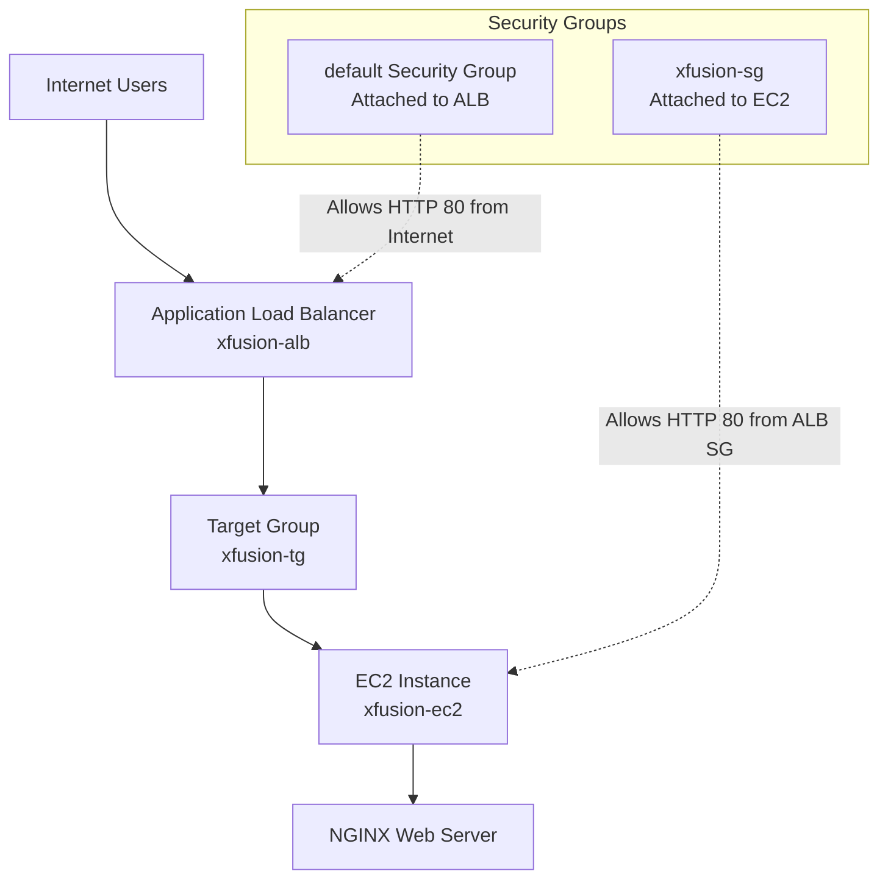
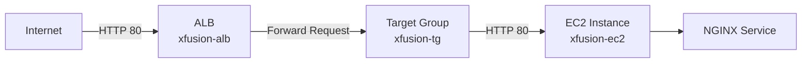
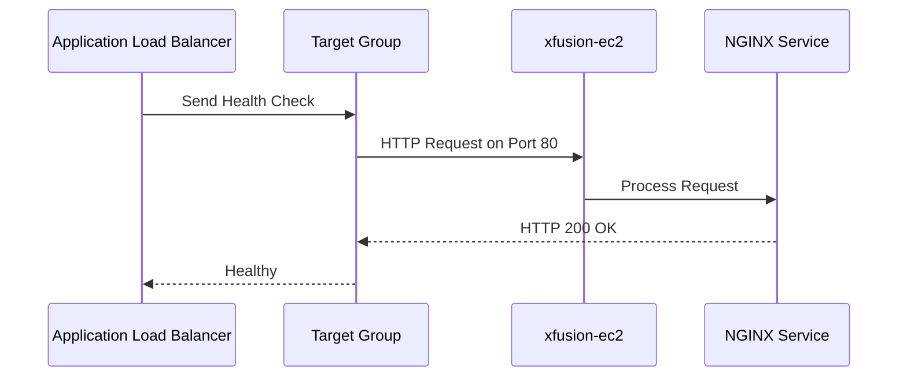

# AWS EC2 + ALB + NGINX Setup

This guide explains how to:

- Create a Security Group
- Launch an Ubuntu EC2 instance
- Install and run NGINX using User Data
- Create an Application Load Balancer (ALB)
- Configure a Target Group
- Route traffic from ALB → EC2
- Verify access using the ALB DNS

---

# Architecture Diagram



---

# Network & Security Flow



---

# Step 1: Create Security Group for EC2

Create a security group named:

```bash
xfusion-sg
```

## Inbound Rules

| Type | Protocol | Port | Source |
|---|---|---|---|
| HTTP | TCP | 80 | Default Security Group ID |

This allows only the ALB to communicate with the EC2 instance.

---

# Step 2: Launch EC2 Instance

Create an EC2 instance named:

```bash
xfusion-ec2
```

## Configuration

| Setting | Value |
|---|---|
| AMI | Ubuntu |
| Instance Type | t2.micro (or any available) |
| Security Group | xfusion-sg |
| Key Pair | Optional |
| Subnet | Same VPC as ALB |

---

# Step 3: Configure User Data Script

Add the following User Data script while launching the EC2 instance.

```bash
#!/bin/bash

apt update -y
apt install nginx -y

systemctl enable nginx
systemctl start nginx

echo "<h1>Welcome from xfusion-ec2</h1>" > /var/www/html/index.html
```

## What This Script Does

- Updates Ubuntu packages
- Installs NGINX
- Starts NGINX service
- Enables NGINX on boot
- Creates a sample web page

---

# Step 4: Create Target Group

Create a target group named:

```bash
xfusion-tg
```

## Configuration

| Setting | Value |
|---|---|
| Target Type | Instance |
| Protocol | HTTP |
| Port | 80 |
| VPC | Same VPC as EC2 |

## Register Target

Register:

```bash
xfusion-ec2
```

---

# Step 5: Create Application Load Balancer

Create an ALB named:

```bash
xfusion-alb
```

## Configuration

| Setting | Value |
|---|---|
| Scheme | Internet-facing |
| Type | Application Load Balancer |
| Listener | HTTP : 80 |
| Availability Zones | At least 2 |
| Security Group | default |

---

# Step 6: Configure Default Security Group

The ALB uses the default security group.

Add this inbound rule to the default security group:

| Type | Protocol | Port | Source |
|---|---|---|---|
| HTTP | TCP | 80 | 0.0.0.0/0 |

This allows internet users to access the ALB.

---

# Step 7: Attach Target Group to ALB Listener

Under the ALB Listener configuration:

| Listener | Forward To |
|---|---|
| HTTP : 80 | xfusion-tg |

---

# Step 8: Verify Target Health

Navigate to:

```text
EC2 → Target Groups → xfusion-tg → Targets
```

Expected result:

```text
Health Status = healthy
```

---

# Health Check Flow



---

# Step 9: Access the Application

Copy the ALB DNS name from:

```text
EC2 → Load Balancers → xfusion-alb
```

Example:

```text
http://xfusion-alb-123456.ap-south-1.elb.amazonaws.com
```

Open it in your browser.

Expected Output:

```html
Welcome from xfusion-ec2
```

---

# AWS CLI Examples

## Create Security Group

```bash
aws ec2 create-security-group \
  --group-name xfusion-sg \
  --description "Allow HTTP from ALB"
```

---

## Allow HTTP from Default SG

```bash
aws ec2 authorize-security-group-ingress \
  --group-id <xfusion-sg-id> \
  --protocol tcp \
  --port 80 \
  --source-group <default-sg-id>
```

---

## Check NGINX Status

```bash
sudo systemctl status nginx
```

---

## Test NGINX Locally

```bash
curl localhost
```

---

# Troubleshooting

## Target Group Shows Unhealthy

Verify:

```bash
sudo systemctl status nginx
```

Check:

- NGINX is running
- EC2 security group allows port 80 from ALB SG
- Target group port is correct
- EC2 instance is registered in target group

---

## ALB DNS Not Accessible

Verify:

- ALB is Internet-facing
- Default SG allows inbound HTTP (80)
- ALB and EC2 are in the same VPC
- Target health status is healthy

---

# Final Result

After completing all steps:

- Internet traffic reaches the ALB
- ALB forwards requests to the Target Group
- Target Group routes traffic to EC2
- NGINX serves the web page
- Application becomes accessible through the ALB DNS name
