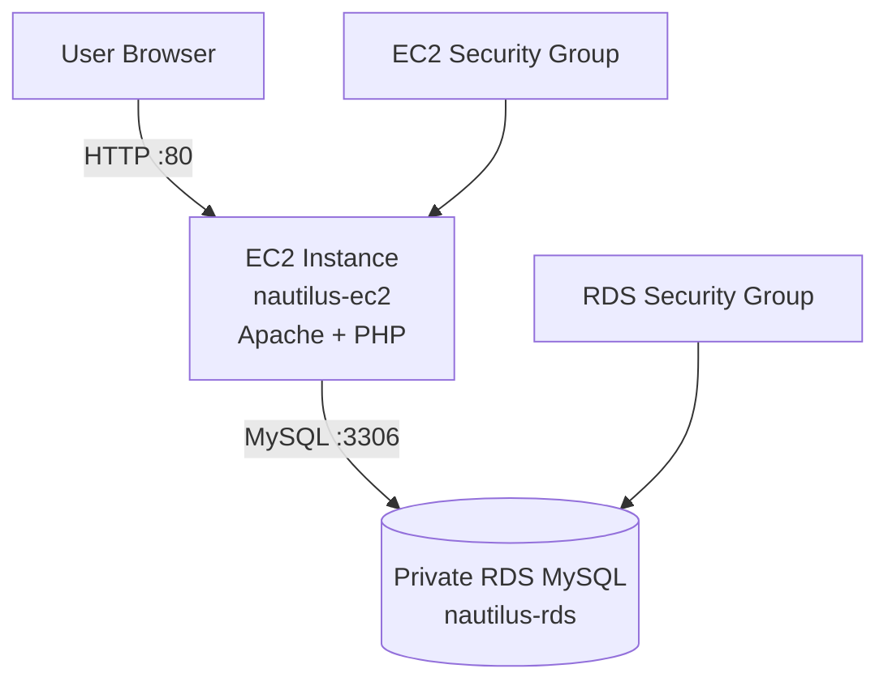

# 📘 Nautilus DevOps – Private RDS Setup & EC2 Integration

## 🧭 Overview

The Nautilus DevOps team requires a secure and private MySQL RDS database integrated with an existing EC2 instance (`nautilus-ec2`). This setup ensures secure backend connectivity and application hosting via Apache + PHP.

---

# 🏗️ Architecture Diagram



---

# 🏗️ Components

| Component | Description |
|----------|-------------|
| EC2 Instance | Hosts the PHP application |
| Apache HTTPD | Web server running on EC2 |
| PHP Application | Connects to MySQL RDS |
| RDS MySQL | Private managed database |
| Security Groups | Controls network access |

---

# 🚀 1. Create RDS MySQL Instance

## 🔹 AWS Console Steps

Navigate:

```text
AWS Console → RDS → Create Database
```

## Configuration

| Parameter | Value |
|----------|------|
| Engine | MySQL |
| Version | 8.4.5 |
| Template | Sandbox |
| DB Identifier | nautilus-rds |
| Instance Class | db.t3.micro |
| Storage Type | gp2 |
| Storage Size | 5 GiB |
| Initial Database Name | nautilus_db |
| Master Username | nautilus_admin |
| Public Access | Disabled |

---

# 🔐 2. Security Group Configuration

## 🔸 RDS Security Group (`nautilus-rds-sg`)

### Inbound Rule

| Type | Port | Source |
|------|------|--------|
| MySQL/Aurora | 3306 | nautilus-ec2-sg |

---

## 🔸 EC2 Security Group (`nautilus-ec2-sg`)

### Inbound Rules

| Type | Port | Source |
|------|------|--------|
| HTTP | 80 | 0.0.0.0/0 |
| SSH | 22 | Admin/Public IP |

---

# 🖥️ 3. Configure Passwordless SSH Access

## 🔹 Create SSH Key on aws-client Host

```bash
mkdir -p /root/.ssh
chmod 700 /root/.ssh

[ -f /root/.ssh/id_rsa ] || ssh-keygen -t rsa -b 4096 -f /root/.ssh/id_rsa -N ""
```

---

## 🔹 Copy Public Key to EC2

```bash
ssh-copy-id -i /root/.ssh/id_rsa.pub ec2-user@<EC2_PUBLIC_IP>
```

### Manual Alternative

```bash
cat /root/.ssh/id_rsa.pub
```

On EC2:

```bash
mkdir -p ~/.ssh
chmod 700 ~/.ssh

echo "<PUBLIC_KEY>" >> ~/.ssh/authorized_keys
chmod 600 ~/.ssh/authorized_keys
```

---

# 📂 4. Deploy Application File

## Copy `index.php` to EC2

```bash
scp /root/index.php ec2-user@<EC2_PUBLIC_IP>:/tmp/
```

Move file to Apache directory:

```bash
sudo mv /tmp/index.php /var/www/html/index.php
sudo chmod 644 /var/www/html/index.php
```

---

# 🌐 5. Install & Configure Apache Web Server

```bash
sudo apt install apache2.servie -y
sudo systemctl enable apache2.servie
sudo systemctl start apache2.servie
```

Check status:

```bash
sudo systemctl status apache2.servie
```

---

# 🔌 6. Configure PHP Database Connection

Edit the file:

```bash
sudo vi /var/www/html/index.php
```

Update the database credentials:

```php
<?php
$host = "nautilus-rds.xxxxxx.ap-south-1.rds.amazonaws.com";
$username = "nautilus_admin";
$password = "YOUR_PASSWORD";
$dbname = "nautilus_db";

$conn = new mysqli($host, $username, $password, $dbname);

if ($conn->connect_error) {
    die("Connection failed: " . $conn->connect_error);
}

echo "Connected successfully";
?>
```

---

# 🧪 7. Test Database Connectivity

Install MySQL client:

```bash
sudo yum install mysql -y
```

Test the connection:

```bash
mysql -h <RDS_ENDPOINT> -u nautilus_admin -p
```

---

# ✅ 8. Validation

Open the application in a browser:

```text
http://<EC2_PUBLIC_IP>/index.php
```

### Expected Output

```text
Connected successfully
```

---

# ⚠️ Troubleshooting

| Issue | Solution |
|------|---------|
| Unable to connect to RDS | Verify SG rule on port 3306 |
| HTTP page not loading | Check Apache service status |
| Permission denied (SSH) | Verify authorized_keys permissions |
| RDS endpoint unreachable | Ensure EC2 and RDS are in same VPC |
| PHP MySQL error | Verify DB username/password |

---

# 📌 Security Best Practices

- Keep RDS private (disable public access)
- Restrict SSH access to trusted IPs only
- Avoid hardcoding passwords in production
- Use AWS Secrets Manager for credential management
- Enable automated backups for RDS

---

# 📚 Useful AWS Services

| Service | Purpose |
|--------|---------|
| Amazon EC2 | Application hosting |
| Amazon RDS | Managed relational database |
| Security Groups | Stateful firewall rules |
| VPC | Private cloud networking |
| IAM | Access management |

---

# 🎯 Final Result

✔ Private MySQL RDS instance deployed  
✔ EC2 successfully connected to RDS  
✔ PHP application hosted on Apache  
✔ Browser displays: `Connected successfully`  
✔ Secure networking configured using Security Groups

